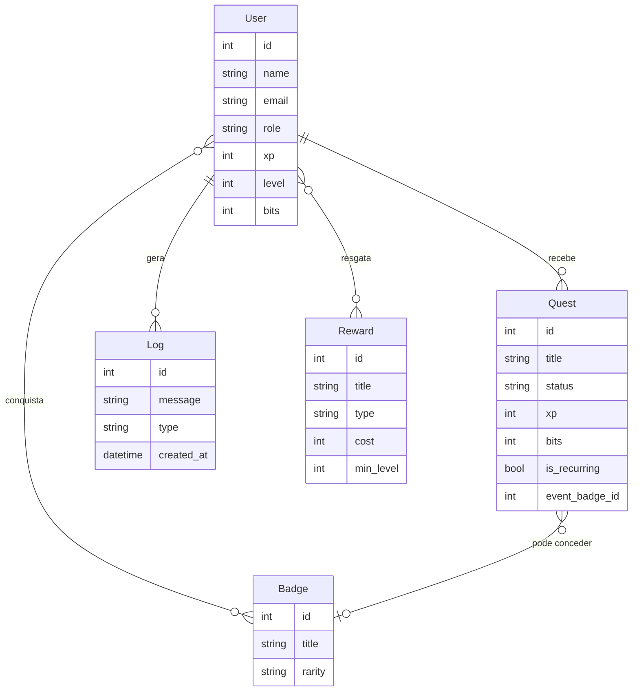
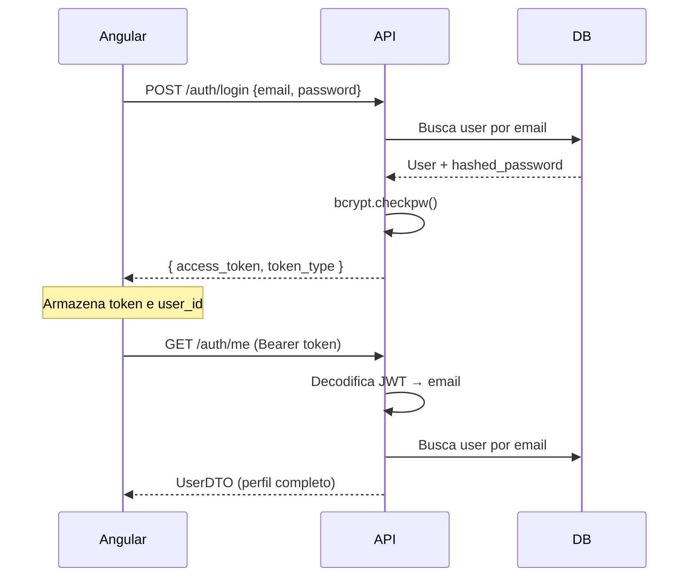
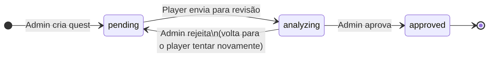
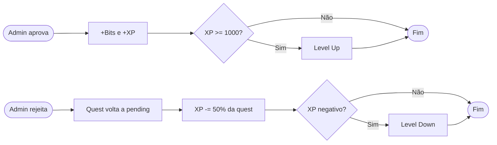
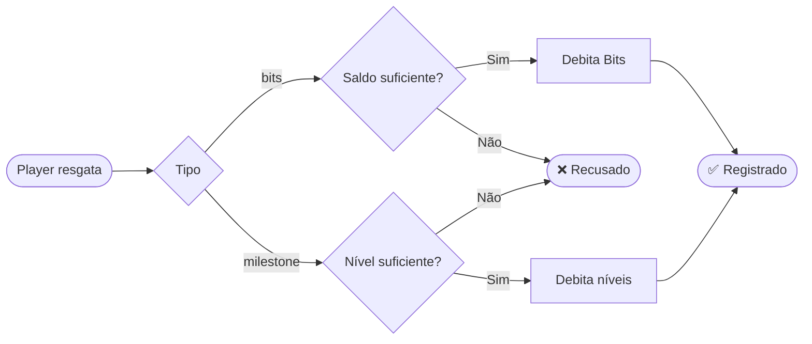
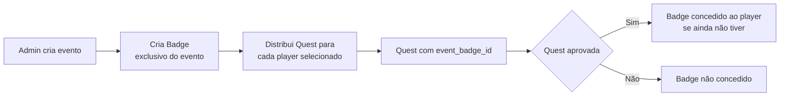

# Home Guild — Backend

> Sistema de gamificação de tarefas domésticas. Transforma afazeres cotidianos em quests de RPG, recompensando jogadores com XP, níveis, Bits e conquistas.

---

## Visão Geral

O sistema é dividido em dois papéis: **Admin** e **Player**.

- O **Admin** cria e distribui quests, cria eventos especiais, aprova ou rejeita as tarefas submetidas pelos jogadores e gerencia a loja de recompensas.
- O **Player** recebe quests, as envia para revisão quando concluídas, acumula XP e Bits, sobe de nível e resgata recompensas.

---

## Entidades de Negócio

### User
Representa tanto admins quanto players. O campo `role` diferencia os dois (`"admin"` ou `"user"`). Players acumulam `xp`, `level` e `bits`.

### Quest
Tarefa atribuída a um player específico. Passa por um ciclo de vida com quatro estados: `pending → analyzing → approved | pending (rejeitada)`.

### Badge
Conquista desbloqueada por eventos especiais. Associada a um player via tabela de ligação. Cada badge tem raridade: `comum`, `raro` ou `lendario`.

### Reward
Recompensa disponível na loja. Pode ser comprada com **Bits** (`type: "bits"`) ou desbloqueada gastando **níveis** acumulados (`type: "milestone"`).

### Log
Registro de toda ação relevante do sistema (aprovações, rejeições, level ups, compras). É a linha do tempo do player.

---

## Diagrama de Entidades

---

## Fluxos Principais

### 1. Autenticação

O frontend Angular autentica via email/senha e recebe um JWT com validade de 24h. Todas as rotas protegidas validam esse token.

---

### 2. Ciclo de Vida de uma Quest

**Quests recorrentes** (`is_recurring: true`) são templates que o admin pode replicar diariamente via `POST /admin/quests/reset-daily`. O sistema verifica se já existe uma cópia pendente para o mesmo player antes de criar uma nova.

---

### 3. Fluxo de Aprovação e Gamificação

> Nível máximo: **15**. Ao atingi-lo, XP para de acumular. No nível mínimo **1**, XP nunca fica negativo. Quests de evento concedem um badge ao player quando aprovadas.

---

### 4. Loja de Recompensas

Dois tipos de reward com moedas diferentes:

| Tipo | Moeda | Mecânica |
|---|---|---|
| `bits` | Bits | Compra direta pelo saldo acumulado |
| `milestone` | Níveis | Gasta níveis conquistados — mecânica de prestígio |

---

### 5. Eventos Especiais

Admins podem criar eventos que distribuem uma quest com um badge exclusivo atrelado. Ao ter a quest aprovada, o player recebe o badge automaticamente.

---

## Regras de Negócio

| Regra | Valor |
|---|---|
| XP por nível | 1000 |
| Nível máximo | 15 |
| Penalidade por rejeição | 50% do XP da quest |
| Nível mínimo | 1 (nunca desce abaixo) |
| Validade do token JWT | 24 horas |
| Logs por consulta (padrão) | 20 mais recentes |

---

## Rotas por Domínio

### Autenticação `/auth`
| Método | Rota | Descrição |
|---|---|---|
| POST | `/auth/register` | Cadastra novo player |
| POST | `/auth/login` | Retorna JWT |
| GET | `/auth/me` | Retorna perfil do usuário logado |

### Player `/users` `/quests` `/rewards` `/logs`
| Método | Rota | Descrição |
|---|---|---|
| GET | `/users/dashboard` | Perfil, badges, logs recentes e quests ativas |
| POST | `/quests/{id}/submit` | Envia quest para revisão |
| GET | `/rewards/shop` | Lista recompensas com flag `redeemed` |
| POST | `/rewards/{id}/redeem` | Resgata uma recompensa |
| GET | `/logs` | Histórico de ações do player |

### Admin `/admin`
| Método | Rota | Descrição |
|---|---|---|
| GET | `/admin/analytics` | Métricas de todos os players e do sistema |
| GET | `/admin/users/players` | Lista todos os players |
| GET | `/admin/quests/analyzing` | Quests aguardando revisão |
| POST | `/admin/quests/{id}/status` | Aprova ou rejeita uma quest |
| POST | `/admin/quests` | Cria quests para um ou mais players |
| POST | `/admin/quests/reset-daily` | Regenera quests recorrentes do dia |
| POST | `/admin/events` | Cria evento com badge exclusivo |
